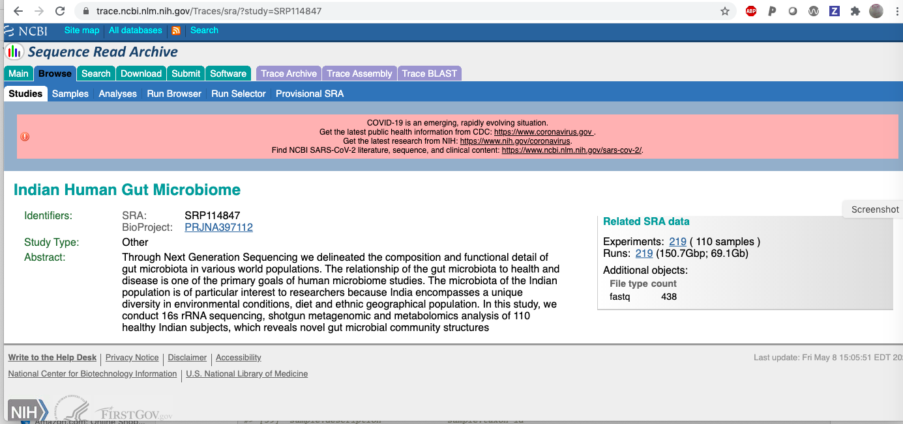

```{r, include = FALSE}
knitr::opts_chunk$set(
  collapse = TRUE,
  comment = "#>"
)
library(BiocStyle)
```

# Introduction

This vignette reviews basic aspects of interacting with omicidx to
obtain metadata about metagenomics studies available in NCBI SRA.

## A quick view of a query about a study

To get things rolling, let's assume we know the identifier for
an SRA _study_ of interest: SRP114847.  How we discover identifiers
for studies or families of studies will be discussed later.

We can obtain a rectangular table of information about SRP114847
by querying a specific _endpoint_ of the omicidx API.  We'll
use the "runs for study" endpoint and then discuss why and how afterwards.
```{r ck1, cache=TRUE}
library(tibble)
metadata=as_tibble(jsonlite::fromJSON(txt=
   url('https://api.omicidx.cancerdatasci.org/sra/studies/SRP114847/runs?size=500'),
   flatten=TRUE)$hits)
dim(metadata)
```
So there are 219 rows returned.  We
can visit [the study level page at SRA](https://trace.ncbi.nlm.nih.gov/Traces/sra/?study=SRP114847) to find:



The mention of 219 runs suggests that the API did its job correctly.

## The fields returned

On the basis of this query, the `metadata` table could have
no more than 500 rows.  What are the fields returned by our query?
```{r lkf}
colnames(metadata)
```
There is some
structure in the field names.  There are four families of fields,
base-level, study-level, experiment-level, and sample-level.
The study/experiment/sample hierarchy reflects
the fundamental _data model_ of NCBI SRA.  

It is somewhat curious that the field names do not include the token `run`.
It seems reasonable to say that 'run' is a synonym for 'experiment', but the
relationship is not always one-to-one.  In this case,
we see that each row returned has a unique experiment accession
number:
```{r chkl}
length(unique(metadata$experiment.accession))
```

## The sample attributes

A challenging aspect of SRA metadata is the diversity of sample attributes
recorded, which varies from study to study.  The `metadata` `sample.attributes`
field is nested within the metadata table, and consists of a list of
tag-value pairs.  As examples:
```{r lktv}
metadata$sample.attributes[1:2]
```
This is somewhat cumbersome but it allows for diversity in metadata
capture from sample to sample.

To transform the `sample.attributes` to a table with one
row per run, tidyr pivoting is very efficient:
```{r tickle}
sampatts = metadata %>% dplyr::select(accession, sample.attributes) %>% 
    tidyr::unnest(sample.attributes) %>% 
    tidyr::pivot_wider(names_from='tag', values_from='value') 
DT::datatable(sampatts)
```
With this interactive table we can quickly see that there is diversity
in geographic location (sort on `lat_lon`), and diet (sort on `host_diet`),
but not on `env_material` (sort on it).

So, with very little code, we've learned a lot about SRP114847.
Now let's learn more about the API.

# Reflectance in OmicIDX

## The basic idea -- listing the available endpoints

The OmicIDX system is developed using OpenAPI 3.0.  It is possible
to learn about the features of OmicIDX by parsing a JSON
document.
```{r lkjso}
ref  = jsonlite::fromJSON("https://api.omicidx.cancerdatasci.org/openapi.json")
names(ref)
```
The `paths` element is really useful for programming with the API.
```{r lklk}
names(ref$paths)
```
It has its own substructure, which you can explore using
an expandable tree -- try `listviewer::jsonedit(ref)`.
For now we'll focus on the endpoint we used.
```{r dolistv}
ourendpt = "/sra/studies/{accession}/experiments"
as.data.frame(cbind(qualname=ref$paths[[ourendpt]]$get$parameters$name, 
  ref$paths[[ourendpt]]$get$parameters$schema))  # wanted datatable but threw warning
```

## Trying out a different endpoint

We found that `refs$paths` has lots of information that our software
can use to figure out what it can do with the OmicIDX API.  Here we'll add
a lucene query for the sra/studies endpoint.  We'll modify the default
number of hits to retrieve, which is 10, specifying that we want up to 15 records.
We'll use `q=microbiome%20AND%20cancer` as a Lucene query.
```{r domcq,cache=TRUE}
mcq = jsonlite::fromJSON(
 "https://api.omicidx.cancerdatasci.org/sra/studies?q=microbiome%20AND%20cancer&size=15",
 flatten=TRUE)
as_tibble(mcq$hits)
```

## What we can do with the `sra/studies` endpoint

Let's use the `refs` entity computed above to see what
we can request using the `sra/studies` endpoint.
```{r modit}
ourendpt = "/sra/studies"
as.data.frame(cbind(qualname=ref$paths[[ourendpt]]$get$parameters$name, 
  ref$paths[[ourendpt]]$get$parameters$schema))  # wanted datatable but threw warning
```

The `q` parameter is used to specify queries in the Lucene query format.  We'll
return to that later.

# Programmatic approaches to inspecting resources

## A single run

Consider the content of the
[inst/curated folder](https://github.com/waldronlab/curatedMetagenomicDataCuration/tree/master/inst/curated)
of the curatedMetagenomicDataCuration repository.  This is a collection of
tsv files with sample attributes and `NCBI_accession` numbers for the samples.
Each tsv file has a name in format `[tag]_[year]` where `tag` is often an author name.

The first folder is called `AsnicarF_2017`.  There are two files: the `AsnicarF_2017_metadata.tsv`
and a python program.  Other folders may have only the tsv file.

Let's get information on a specific sample in this study.  We read from the tsv
file in github the SRR number of the first row: SRR4052021.  This is a
token that can be used with the /sra/runs endpoint of OmicIDX.

```{r kjkj,cache=TRUE}
pref = "https://api.omicidx.cancerdatasci.org/"
do_one = "sra/runs/SRR4052021"
lk1 = jsonlite::fromJSON(paste0(pref, do_one)) 
names(lk1)
```

So there is a straightforward way to get detailed metadata for
an SRR.  Massaging the output here, to get that which
is useful for metagenomic analysis, is an exercise.

## A study

We encapsulated code we used above to get
metadata on the `AsnicarF_2017` study in the
function `samp_atts_by_study`, that we'll show
and demonstrate here.  We determined the
SRP number from the call above.

```{r dosa,cache=TRUE}
suppressPackageStartupMessages({
library(md4mg)
})
samp_atts_by_study
sa_asnicar = samp_atts_by_study()
dim(sa_asnicar)
DT::datatable(sa_asnicar)
```

One could say that this is the uncurated sample metadata for this study.
Of some concern is the fact that there are 28 records here but only
25 records in the tsv file.
